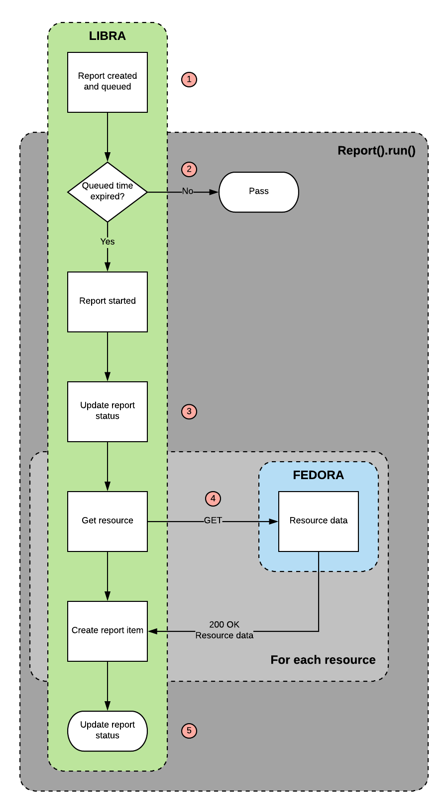

# libra
A microservice to generate reports on files and activities in Fedora.

libra is part of [Project Electron](https://github.com/RockefellerArchiveCenter/project_electron), an initiative to build sustainable, open and user-centered infrastructure for the archival management of digital records at the [Rockefeller Archive Center](http://rockarch.org/).

## Setup

Install [git](https://git-scm.com/) and clone the repository

    $ git clone https://github.com/RockefellerArchiveCenter/libra.git
      
Install [Docker](https://store.docker.com/search?type=edition&offering=community) and run docker-compose from the root directory

    $ cd libra
    $ docker-compose up
    
Once the application starts successfully, you should be able to access the application in your browser at `http://localhost:8004`

When you're done, shut down docker-compose

    $ docker-compose down

Or, if you wish to remove all local data

    $ docker-compose down -v

## Usage

Reports can be created and scheduled either via a user interface or HTTP POST requests (see below). At regularly scheduled intervals (or when triggered via a POST request), a cron job reviews all pending reports, and runs the reports whose `queued_time` is in the past.

## Routes

A user interface which supports creating, viewing and downloading of reports is available at `/reports`.

| Method | URL | Parameters | Response  | Behavior  |
|--------|-----|---|---|---|
|POST|/fixity| |200|Creates a new fixity report|
|GET|/fixity| |200|Returns a list of fixity reports|
|GET|/fixity/{id}| |200|Returns an individual fixity report|
|DELETE|/fixity/{id}| |200|Deletes an individual fixity report|
|POST|/formats| |200|Creates a new file format report|
|GET|/formats| |200|Returns a list of file format reports|
|GET|/formats/{id}| |200|Returns an individual file format report|
|DELETE|/formats/{id}| |200|Deletes an individual file format report|
|POST|/run-reports/{report_type}| |200|Runs the reports specified by the `report_type`|
|GET|/status||200|Returns the status of the microservice|
|GET|/schema.json||200|Returns a JSON representation of the Open API schema for the service|

## License

This code is released under an [MIT License](LICENSE).
